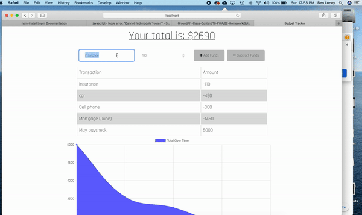

# Budget-Tracker-HW Online/Offline Budget Trackers

# User Story
AS AN avid traveller
I WANT to be able to track my withdrawals and deposits with or without a data/internet connection
SO THAT my account balance is accurate when I am traveling.  Let's just call it "responsible travel allowance."

Functionality will be added to our existing Budget Tracker application to allow for offline access and functionality.

The user will be able to add expenses and deposits to their budget with or without a connection. When entering transactions offline, they should populate the total when brought back online.

Offline Functionality:

  * Enter deposits offline

  * Enter expenses offline

When brought back online:

  * Offline entries should be added to tracker.

## Business Context

Giving users a fast and easy way to track their money is important, but allowing them to access that information anytime is even more important. Having offline functionality is paramount to our applications success.

# Technologies / Packages
NodeJS
Mongoose, Morgan, Express.
MongoDB
Compression, 
Heroku
Javascript, HTML, CSS

